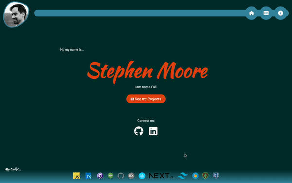
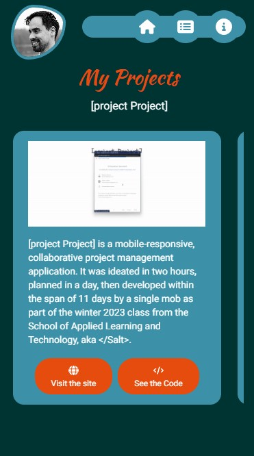
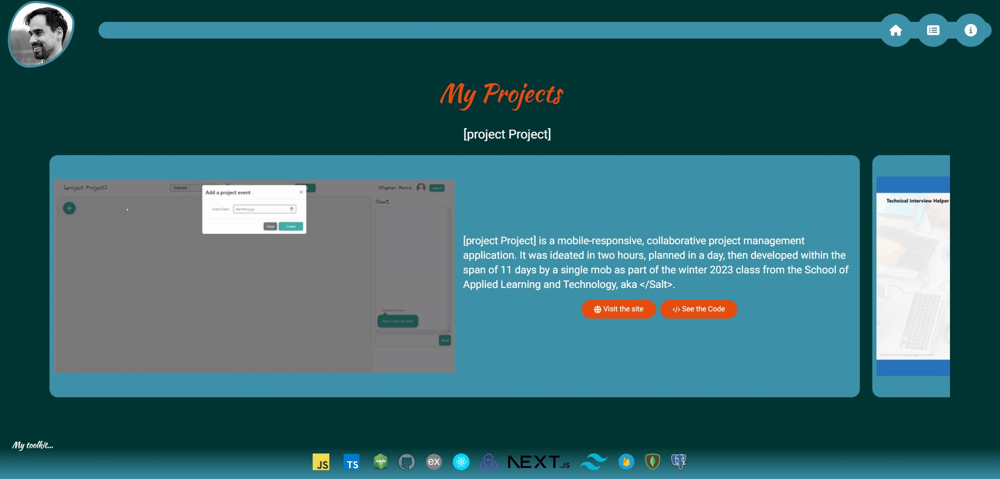

# Personal Portfolio Site

 

---

This is a SPA portfolio website, built with React. It is animated and fully responsive. The finished product is deployed [here](https://next-portfolio-cyan-nine.vercel.app/). It was built to showcase both past projects and previous skills. I have built it to be easily scalable and easily-updated by utilising reusable components and dynamically generating project slides. This means future projects can easily be added via a  simple JSON and a picture.

TypeScript was used to ensure type-safety. 

## Responsive Design

The design was produced with a mobile-first approach, with breakpoints used to ensure the best layouts for different devices, though relative units and responsive design choices meant that media queries were not required for every change. examples of the homepage on mobile and fullscreen are below.

 

---

 

## Tailwind

This Project was build with Tailwind CSS. I had not used it prior to starting this and wanted to challenge myself, whilst also learning to use a new tool. By utilising the config file, I was able to easily store fonts and colour choices for repeated use.

## Project Scroller

Whilst an animation library could have been used for the project scrolling, I wanted to use CSS to really test my design, as well as my new Tailwind CSS skills. This also ensures that I am able to keep much of the content as server-side components, improving load times.

## Next Steps

Whilst the site itself is complete, I have been considering the addition of a contact form, in addition to the existing social links. I am also open to further ideas.

## Tools
This is a [Next.js](https://nextjs.org/) project. It utilises Tailwind CSS (including tailwind classes using @apply) and animations used the Framer-Motion library, as well as the React-TypingAnimation Library. 

Icons were added via FontAwesome, as well as [GitHub](https://icons8.com/icon/12599/github) and [LinkedIn](https://icons8.com/icon/8808/linkedin) icons from Icons8.
